# Architecture &amp; Flowcharts — Internal Support CRM

> **Status:** scaffolding complete · implementation in progress
> **Last updated:** 2026-04-11
> **Branch:** `claude/execute-prompt-docs-rBNtz`

This document is the companion to the build prompt in the project brief.
It captures the architecture, component boundaries, flowcharts, and the
implementation roadmap so a non-technical operator — and any future
developer — has a single reference.

All diagrams are written in [Mermaid](https://mermaid.js.org/) so they render
natively on GitHub.

---

## Table of Contents

1. [Guiding Principles](#guiding-principles)
2. [High-Level System Architecture](#high-level-system-architecture)
3. [Runtime Configuration Flow](#runtime-configuration-flow)
4. [Database Abstraction Layer](#database-abstraction-layer)
5. [Request Lifecycle](#request-lifecycle)
6. [Freshdesk Import Wizard Flow](#freshdesk-import-wizard-flow)
7. [Storage Abstraction (MinIO ↔ S3)](#storage-abstraction-minio--s3)
8. [Deployment Topologies](#deployment-topologies)
9. [Ticket State Machine](#ticket-state-machine)
10. [AI Chatbot RAG Flow](#ai-chatbot-rag-flow)
11. [Backup &amp; Recovery Flow](#backup--recovery-flow)
12. [Data Model](#data-model)
13. [Admin Panel Tab Map](#admin-panel-tab-map)
14. [Security Model](#security-model)
15. [Implementation Roadmap](#implementation-roadmap)

---

## Guiding Principles

1. **Zero hardcoded configuration.** Every value a human might want to change —
   database URL, SMTP host, storage endpoint, API base URL — lives in
   `admin_settings.json` and is editable from the Admin Panel.
2. **Database agnostic.** SQL Server Express and MongoDB are first-class peers.
   A single `DatabaseInterface` abstraction means the rest of the codebase
   never cares which one is active.
3. **Storage agnostic.** MinIO and S3 implement the same `ObjectStorage`
   protocol. Swap one line of config to migrate.
4. **Local-first, cloud-ready.** `docker-compose up` must produce a fully
   functional CRM. AWS deployment is a button in the Admin Panel.
5. **Non-technical operator.** If a feature cannot be configured from the UI,
   it is broken.
6. **Auditable.** Every admin action and data mutation writes an `audit_log`
   row.
7. **Reversible.** Backups run on a schedule; restore is a one-click action.

---

## High-Level System Architecture

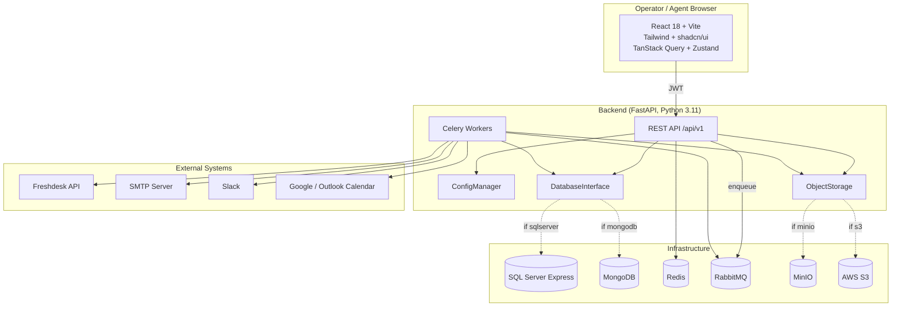

**Notes**

- The frontend **never** embeds a backend URL. It fetches `/config.json` at
  boot, which is maintained by the backend from `admin_settings.json`.
- The same binary runs locally and on AWS. Only the `deployment` section of
  the settings changes.

---

## Runtime Configuration Flow

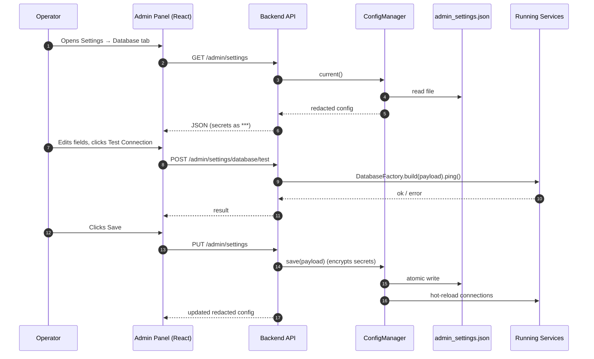

Key rules:

- Secrets leaving the backend are always redacted to `"***"`.
- Saving is **atomic**: write to temp file, fsync, rename.
- After save, long-lived connections are rebuilt so no restart is needed.

---

## Database Abstraction Layer

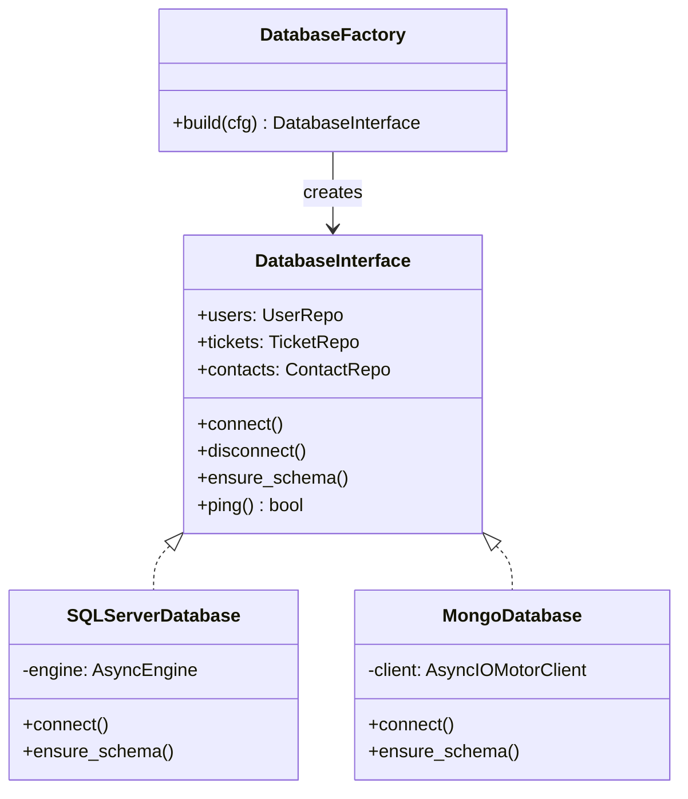

**Why this matters:** every feature module imports `DatabaseInterface`, never
`sqlalchemy` or `motor` directly. Swapping backends is a config change.

---

## Request Lifecycle

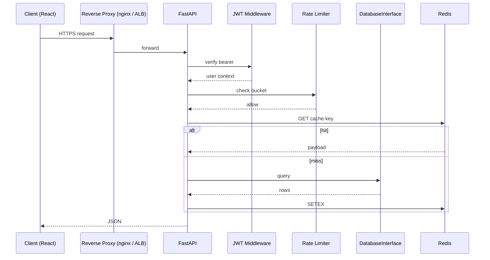

---

## Freshdesk Import Wizard Flow

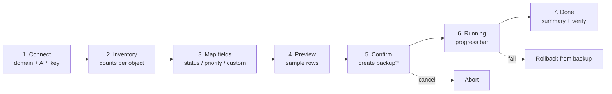

**Background job** (Celery, `freshdesk_import_job`):

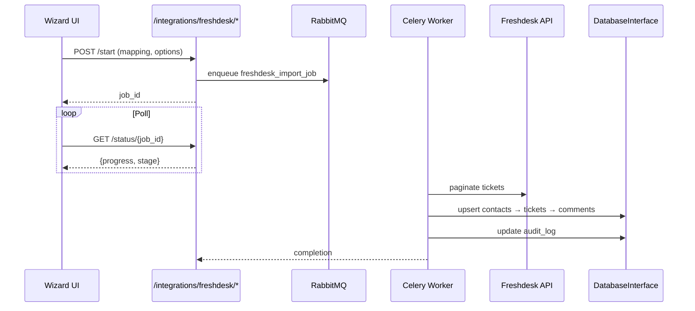

---

## Storage Abstraction (MinIO ↔ S3)

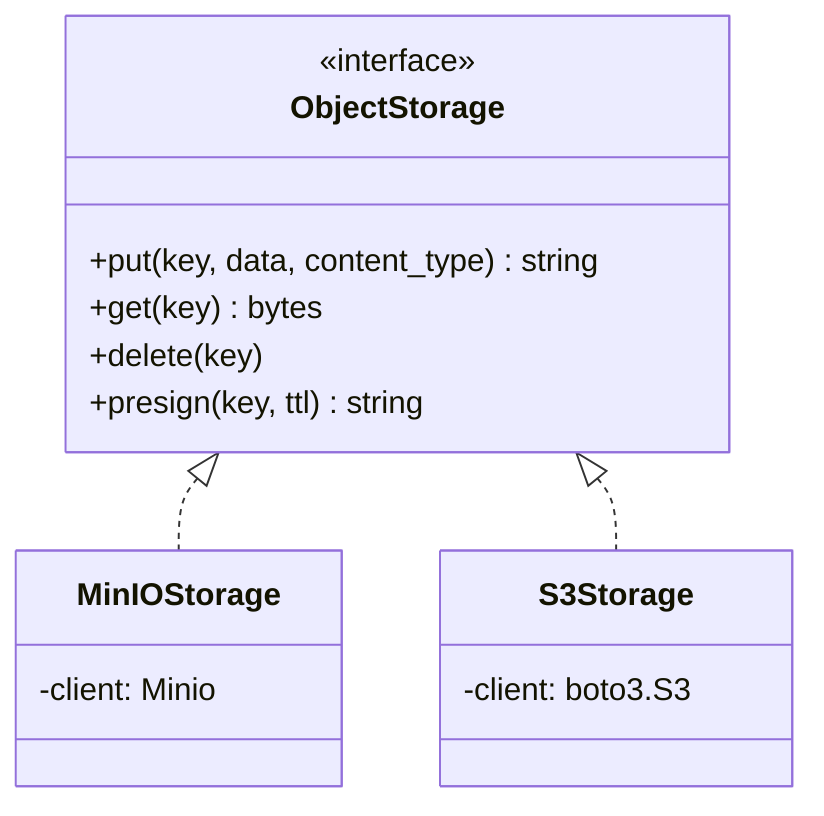

Upload flow from the ticket UI:

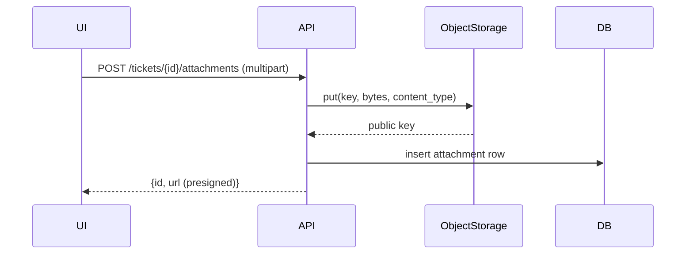

---

## Deployment Topologies

### Local (Docker Compose)

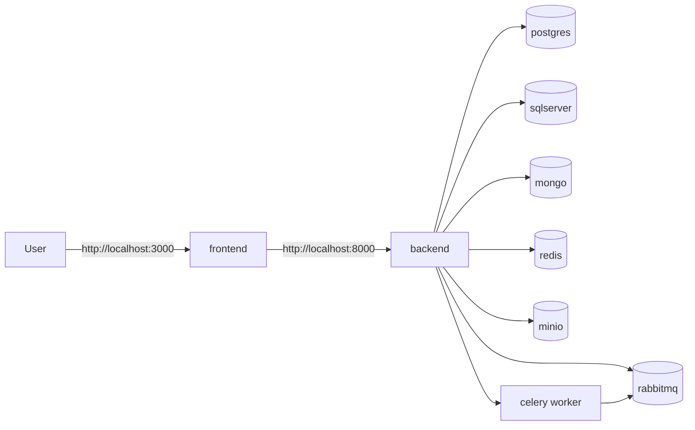

### AWS

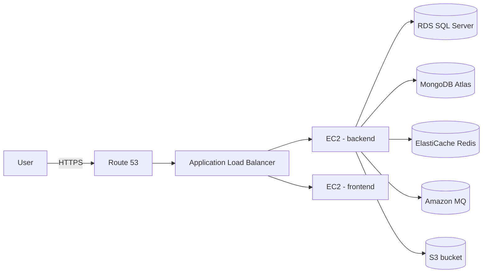

Switching from Local to AWS only changes:
- `deployment.environment` → `aws`
- `database.*` → RDS / Atlas connection strings
- `storage.type` → `s3`
- `email.smtp_host` → SES or external SMTP

No code changes.

---

## Ticket State Machine

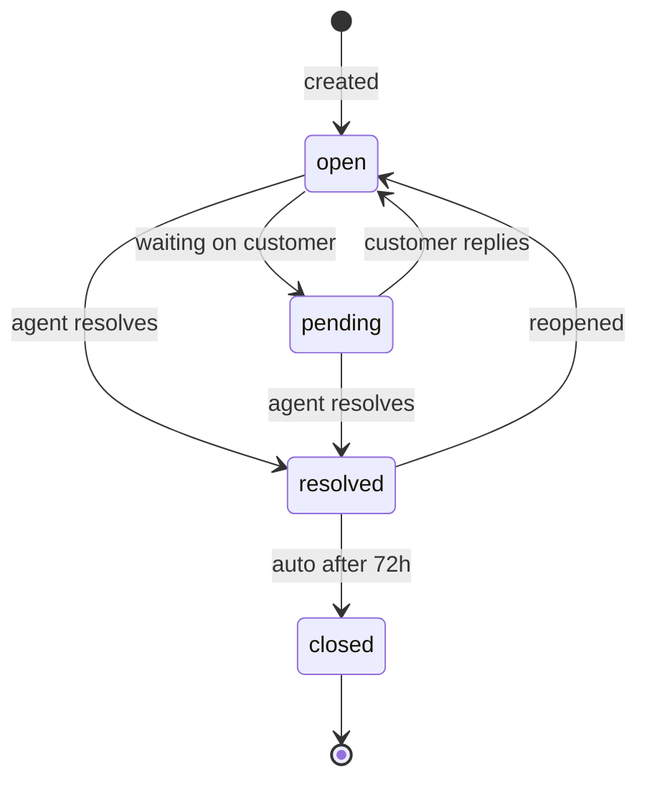

---

## AI Chatbot RAG Flow

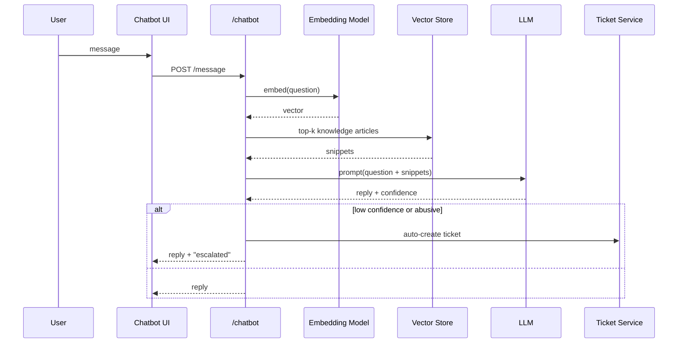

---

## Backup &amp; Recovery Flow

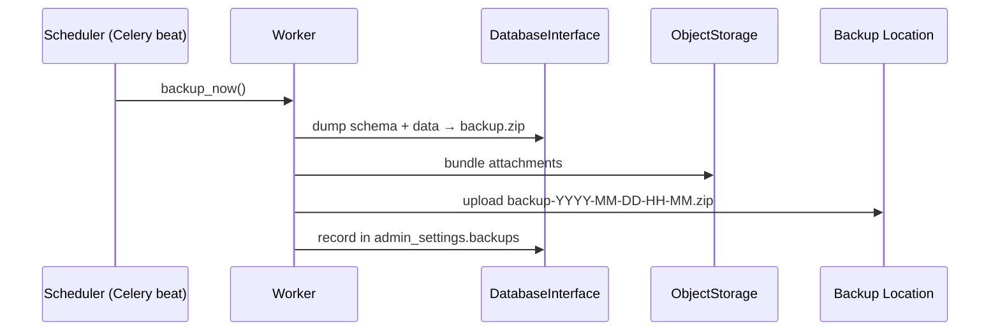

Restore reverses the steps: pick a backup → worker restores DB → swaps active
storage bucket → audit log records event.

---

## Data Model

See [`backend/app/models/schema.sql`](../backend/app/models/schema.sql) for
the SQL Server DDL. MongoDB uses analogous collections with identical field
names so the `DatabaseInterface` layer can translate seamlessly.

Core entities:

| Entity              | Purpose                                     |
| ------------------- | ------------------------------------------- |
| `users`             | Agents and admins                           |
| `tickets`           | Support tickets                             |
| `ticket_comments`   | Replies &amp; internal notes                |
| `contacts`          | CRM contacts                                |
| `deals`             | Sales pipeline                              |
| `knowledge_articles`| Knowledge base                              |
| `workflows`         | Automation rules (JSON conditions/actions)  |
| `chat_conversations`| Chatbot history                             |
| `admin_settings`    | Persisted Admin Panel state (encrypted)     |
| `audit_log`         | Every admin / data mutation                 |

---

## Admin Panel Tab Map

| Tab              | Backend endpoints                                 | Notes                           |
| ---------------- | ------------------------------------------------- | ------------------------------- |
| Database         | `GET/PUT /admin/settings`, `POST …/database/test` | Dual-DB switch + test           |
| Email            | `POST …/email/test`                               | SMTP credentials                |
| File Storage     | `POST …/storage/test`                             | MinIO ↔ S3 toggle               |
| API              | `GET/PUT /admin/settings`                         | Writes runtime `/config.json`   |
| Integrations     | `/integrations/freshdesk/*`, slack, calendar      | Import wizard launches here     |
| Users            | `/users/*`                                        | RBAC                            |
| Backup &amp; Recovery | `/admin/backup/*`                             | Schedule, backup now, restore   |
| Deployment       | `/admin/deploy/*`                                 | Local ↔ AWS                     |
| System Health    | `/health`, component pings                        | Live status                     |
| About / Help     | static                                            | Docs, version, support          |

---

## Security Model

- **AuthN:** JWT (HS256 by default, RS256 optional) with refresh tokens.
- **AuthZ:** RBAC with Admin, Agent, Viewer roles; Admin required for
  `/admin/*` endpoints.
- **Password storage:** bcrypt, cost factor 12.
- **Secret storage:** Fernet symmetric encryption; master key from OS keyring
  (local) or AWS KMS (cloud).
- **Transport:** HTTPS only in production. Dev uses plain HTTP.
- **Headers:** CSP, HSTS, X-Frame-Options, Referrer-Policy set globally.
- **CSRF:** Double-submit cookie on mutating routes.
- **Rate limiting:** 100 req/min per user via Redis token buckets.
- **Audit:** Append-only `audit_log` table records (user, action, entity,
  entity_id, timestamp, ip).

---

## Implementation Roadmap

### Phase 0 — Scaffold (this commit)
- [x] Repo layout, Docker Compose, configuration skeleton
- [x] FastAPI app + router wiring
- [x] DatabaseInterface, DatabaseFactory, empty adapters
- [x] ConfigManager, crypto stub, bootstrap first-run
- [x] React + Vite + TS frontend skeleton
- [x] Admin Panel with 10 tab shells
- [x] This architecture document

### Phase 1 — Core System (must-have)
- [ ] SQL Server adapter: real SQLAlchemy async engine, Alembic migrations
- [ ] MongoDB adapter: Motor, index creation, cursor helpers
- [ ] Auth: JWT issue / verify / refresh; bcrypt
- [ ] Ticket CRUD, state machine, replies, internal notes
- [ ] Contact + Deal CRUD
- [ ] SMTP integration, verified via Test Email button
- [ ] MinIO upload / download / presigned URLs
- [ ] Admin Panel real forms + Save / Test buttons

### Phase 2 — Advanced Features (should-have)
- [ ] Knowledge base with WYSIWYG + public portal
- [ ] Workflow engine (trigger → conditions → actions, JSON)
- [ ] Analytics dashboards, CSAT surveys
- [ ] AI chatbot (RAG over knowledge base)
- [ ] Freshdesk import wizard (full six-step flow + rollback)

### Phase 3 — Enterprise (nice-to-have)
- [ ] AWS one-click deployment (Terraform in `deploy/aws`)
- [ ] S3 storage adapter
- [ ] Slack + Google / Outlook calendar integrations
- [ ] Custom plugin loader
- [ ] HA / multi-node deployment

### Acceptance Gates
Each phase must pass:

1. `docker-compose up` with zero manual steps
2. `pytest -q` green in `backend/`
3. `npm run build` green in `frontend/`
4. Setup wizard completable by a non-technical user in under 15 minutes
5. Zero hardcoded credentials or URLs (grep gate in CI)
